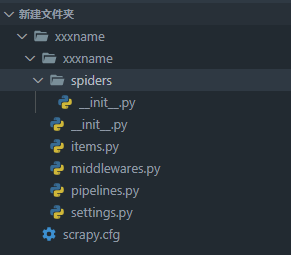
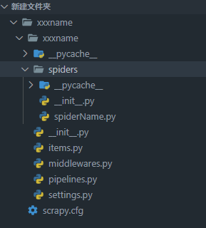

# scrapy数据解析初识
功能：

1.从网站中爬取文字图片视频等数据   

2.进行持久化存储

## scrapy框架
### 什么是框架：
    一个集成了很多功能并且具有很强通用性的一个项目模板(未完成的半成品)

### 如何学习框架：
    专门学习框架封装的各种功能的详细用法

### 什么是scrapy？
    爬虫中封装好的一种常用框架
    功能：
        I.高性能的持久化存储
        II.异步数据下载
        III.高性能数据分析
        IV.分布式

---

## 使用scrapy进行数据解析的准备工作

### I.在终端中创建工程,输入：
```scrapy startproject xxxname```

效果如下:



###   II.进入xxxname目录中
```cd xxxname```
 ###   III.在spiders子目录中创建一个爬虫文件:
```scrapy genspider spiderName www.xxx.com```

效果如下:



#### <font color=red size=5>*注意此时在spider目录下多了一个spiderName的py文件*</font>


 ###   V.执行后发现带问题：显示一大堆不认识的 根据查找错因可知需要将setting.py该配置文件内的

```python
# Obey robots.txt rules
ROBOTSTXT_OBEY = True 改为False
```


 ###   VI.如果觉得显示的信息太多又怕错过错误信息可以在上面的下一行写下：
```LOG_LEVEL='ERROR'```

即只显示错误信息
 ###   VII.在setting内进行UA伪装

 可直接用下面的UA对
 
 ```
 USER_AGENT = 'Mozilla/5.0 (Windows NT 10.0; Win64; x64) AppleWebKit/537.36 (KHTML, like Gecko) Chrome/91.0.4472.114 Safari/537.36 Edg/91.0.864.59'
```
---
### 接下来是为了利用pipeline进行持久化存储做的准备工作

#### I.导包  
                在spiderName.py中加入:
                    from qiushibaike.items import QiushibaikeItem
效果如下：

```python
import scrapy
from qiushibaike.items import QiushibaikeItem
```


#### II.在配置文件中开启管道

 在setting.py中打开注释:
    
    ITEM_PIPELINES = {
    'qiushibaike.pipelines.QiushibaikePipeline': 300,
    }
---
---
## 进行数据解析

```python
import scrapy
#为持久化存储导包
from qiushibaike.items import QiushibaikeItem

class QiubaiSpider(scrapy.Spider):
    name = 'qiubai'
    # allowed_domains = ['https://www.qiushibaike.com/']
    start_urls = ['https://www.qiushibaike.com/text/']
 
    def parse(self, response):
        i=0 
        # 解析：作者的名称+段子内容
        div_list=response.xpath('//div[@class="col1 old-style-col1"]/div')
        for div in div_list:
            #extract可以将字符串提取出来
            author=div.xpath('./div[1]/a[2]/h2/text()')[0].extract()
            #列表调用了extract()后，则表示将列表中每一个字符串提取出来
            content=div.xpath('./a[1]/div[@class="content"]/span//text()').extract()
            content=''.join(content)
            print(author,content)
            i+=1
            item=QiushibaikeItem()
            item['author']=author
            item['content']=content

            yield item #将item提交给管道 
            print()
            if(i==10):
                break;
        
        return data
```

主程序qiupai.py中的代码

###   如何执行工程:
```scrapy crawl spiderName```

### 利用pipeline进行永久化存储的代码
#### 1.在item类中定义相关的属性
                在item.py中修改:
                    arr1 = scrapy.Field()
                    arr2 = scrapy.Field()
效果如下：

```python
class QiushibaikeItem(scrapy.Item):
    # define the fields for your item here like:
    author = scrapy.Field()
    content = scrapy.Field()
    pass

```


#### 2.将解析的数据封装存储到item类型的对象
                在spiderName.py中加入:
                    item=QiushibaikeItem()
                    item['arr1']=arr1
                    item['arr2']=arr2
                    yield item #将item提交给管道 


#### 3.在管道类的process_item中将其接收到的item对象中的属性进行持久化存储
pipeline.py中原始代码为:
```python
class ScrapyTestPipeline:
    def process_item(self, item, spider):
        return item
```

修改为:

```python
class QiushibaikePipeline:
    fp=None
    #重写父类的一个方法：该方法只在开始爬虫的时候被调用一次
    def open_spider(self,spider):
        print('---开始爬虫---')
        self.fp=open('./qiubai.txt','w',encoding='utf-8')

    #专门用来处理item对象
    #该方法用来接收爬虫文件提交过来的item的对象
    #!!且每接收到一个item对象就被调用一次

    def process_item(self, item, spider):
        
        self.fp.write(item['author']+item['content']+'\n')
        return item

    #重写父类的一个方法：该方法只在关闭爬虫的时候被调用一次
    def close_spider(self,spider):
        print("---结束爬虫---")
        self.fp.close()

```
<font color=red size=5>**注意这里调用item的属性时要用item['attr']而不是item.attr**</font>

